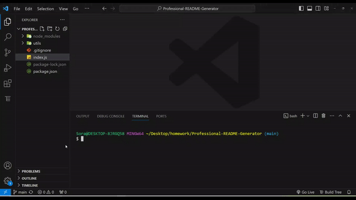

# Professional README Generator

by Yousra Kamal

## Description

This README Generator app helps you quickly and easily generate a README file by using a command-line application to generate one.

## Table of Contents

- [Professional README Generator](#professional-readme-generator)
  - [Description](#description)
  - [Table of Contents](#table-of-contents)
  - [Usage](#usage)
  - [Links](#links)
  - [License](#license)
  - [Contributing](#contributing)
  - [Tests](#tests)

## Usage

When you open the command-line, you are prompted for information about your application repository. After providung all the answers a README.md file will be generated successfully.

## Links

View a complete video demonstration of the application: [Professional README Generator Demo](https://app.screencastify.com/v3/watch/58NtTtBXgaZkyHq8OExP)

## License

 This project is licensed under the MIT license.

## Contributing

N/A

## Tests

N/A

